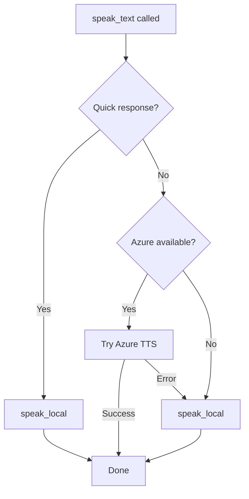

# 🔊 Jarvis TTS Architecture

## Overview

Jarvis uses a **hybrid TTS system** that intelligently routes speech to either local PowerShell TTS or Azure Speech Services based on the type of response.

---

## 🎯 Design Philosophy

**Fast acknowledgments, high-quality responses**

- **Quick acknowledgments** (like "Yes sir") use local TTS for instant feedback
- **Full responses** (like answers to questions) use Azure TTS for natural voice
- **Automatic fallback** to local TTS if Azure is unavailable

---

## 🔀 TTS Routing Logic

### `speak_local(text)` - Local PowerShell TTS

**Used for:**
- Greetings: "Yes sir, how can I help you?"
- Goodbyes: "Goodbye sir"
- Quick confirmations: "One moment sir", "Certainly sir"

**Characteristics:**
- ⚡ **Fast** - Near-instant response
- 🔄 **Synchronous** - Completes before continuing
- 🖥️ **Local** - No internet required
- 📢 **Basic voice** - Windows SAPI voice

**Implementation:**
```python
speak_local("Yes sir")  # Fast, local response
```

### `speak_text(text)` - Smart TTS Router

**Used for:**
- Agent responses
- Full answers to questions
- Error messages
- Complex information

**Routing logic:**
1. **Check if quick response** → Use local TTS
2. **Try Azure TTS first** → High quality voice
3. **Fallback to local** → If Azure unavailable

**Characteristics:**
- 🎤 **High quality** - Natural Azure voice
- 🧠 **Smart routing** - Auto-detects response type
- 🔄 **Graceful fallback** - Always works

**Implementation:**
```python
speak_text("The current time in Tokyo is 3:45 PM")  # Azure TTS
speak_text("Yes sir")  # Automatically uses local TTS
```

---

## 📋 Quick Response List

These phrases **always** use local TTS (defined in `QUICK_RESPONSES`):

```python
QUICK_RESPONSES = {
    "yes sir",
    "yes sir?",
    "yes sir, how can i help you?",
    "goodbye sir",
    "one moment sir",
    "certainly sir",
    "right away sir",
    "understood sir",
}
```

Case-insensitive matching - "YES SIR" matches "yes sir"

---

## 🔧 Configuration

### Azure TTS Setup

**Required environment variables:**
```bash
AZURE_SPEECH_KEY=your_key_here
AZURE_REGION=southafricanorth
AZURE_VOICE=en-US-JennyNeural
```

### Voice Options

Popular voices:
- `en-US-JennyNeural` - American female (default)
- `en-US-GuyNeural` - American male
- `en-GB-RyanNeural` - British male
- `en-GB-SoniaNeural` - British female
- `en-IN-NeerjaNeural` - Indian female

[Full voice list](https://learn.microsoft.com/en-us/azure/ai-services/speech-service/language-support?tabs=tts)

---

## 🔍 How It Works

### Initialization (on startup)

```python
# Try to initialize Azure TTS
if AZURE_SPEECH_KEY != "YOUR_KEY":
    speech_synthesizer = speechsdk.SpeechSynthesizer(...)
    azure_available = True
else:
    azure_available = False
    # Will use local fallback
```

### During Operation



---

## 💡 Usage Examples

### In Main Code

```python
# Quick greeting - uses local TTS
if "hello" in user_input.lower():
    response = "Yes sir, how can I help you?"
    speak_local(response)

# Full response - uses Azure TTS
response = agent.invoke(user_input)
speak_text(response)  # Auto-routes to Azure or local
```

### Adding New Quick Responses

Edit `main/tts.py`:

```python
QUICK_RESPONSES = {
    "yes sir",
    "goodbye sir",
    # Add your own:
    "processing sir",
    "standby sir",
    "acknowledged sir",
}
```

---

## 🎭 Voice Quality Comparison

| Aspect | Local (PowerShell) | Azure Speech |
|--------|-------------------|--------------|
| **Speed** | ⚡ Instant | ~1-2 seconds |
| **Quality** | 📢 Basic SAPI | 🎤 Neural, natural |
| **Internet** | ❌ Not required | ✅ Required |
| **Cost** | 🆓 Free | 💰 ~$1/month |
| **Use case** | Quick responses | Full responses |

---

## 🐛 Troubleshooting

### "Local TTS not working on Windows"

**Check:**
1. PowerShell is available
2. System.Speech assembly accessible
3. No antivirus blocking subprocess calls

**Test:**
```powershell
Add-Type -AssemblyName System.Speech
$speak = New-Object System.Speech.Synthesis.SpeechSynthesizer
$speak.Speak("Test")
```

### "Azure TTS not working"

**Check logs for:**
```
⚠️ Azure TTS initialization failed
```

**Common issues:**
1. Invalid API key
2. Wrong region
3. Network connectivity
4. Voice name typo

**Verify configuration:**
```python
python test_azure_tts.py
```

### "All responses use local TTS"

**This means:**
- Azure key not configured, OR
- Azure initialization failed

**Expected behavior:**
- System logs: `"ℹ️ Azure TTS not configured, will use local fallback"`
- All responses will work, just with basic voice

---

## 🎯 Performance

### Response Time Breakdown

**Quick acknowledgment ("Yes sir"):**
```
User: "jarvis"
  ↓ 0ms - Detect greeting
  ↓ 50ms - speak_local called
  ↓ 200ms - PowerShell TTS speaks
Total: ~250ms
```

**Full response with Azure:**
```
User: "what time is it in Tokyo?"
  ↓ 0ms - Process with agent
  ↓ 2000ms - LLM generates response
  ↓ 1500ms - Azure TTS synthesizes
  ↓ 3000ms - Audio plays
Total: ~6500ms
```

**Full response with local fallback:**
```
User: "what time is it in Tokyo?"
  ↓ 0ms - Process with agent
  ↓ 2000ms - LLM generates response
  ↓ 200ms - Local TTS speaks
Total: ~2200ms (faster but lower quality)
```

---

## 🚀 Future Improvements

Potential enhancements:

1. **Caching** - Cache Azure audio for repeated phrases
2. **Streaming** - Stream Azure audio as it generates
3. **Voice cloning** - Use local voice model matching Azure quality
4. **Custom voices** - Train on specific voice samples
5. **SSML support** - Add prosody, emphasis, pauses

---

## 📝 Code Locations

- **TTS Implementation**: `main/tts.py`
- **Text Mode Usage**: `main/main_text.py`
- **Voice Mode Usage**: `main/main_voice.py`
- **Test Script**: `test_azure_tts.py`

---

**Key Takeaway**: Quick local acknowledgments + high-quality Azure responses = Best user experience! 🎤✨

